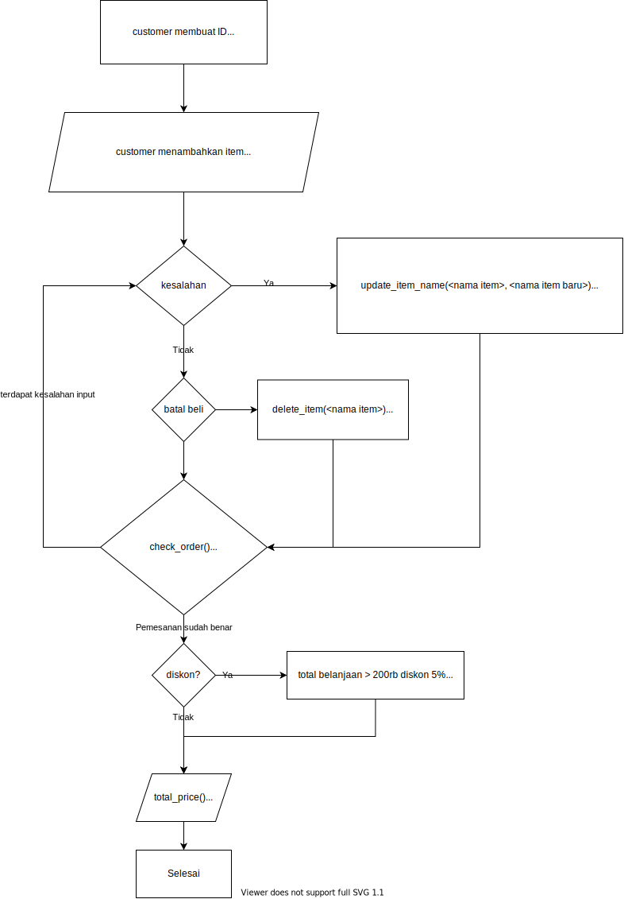
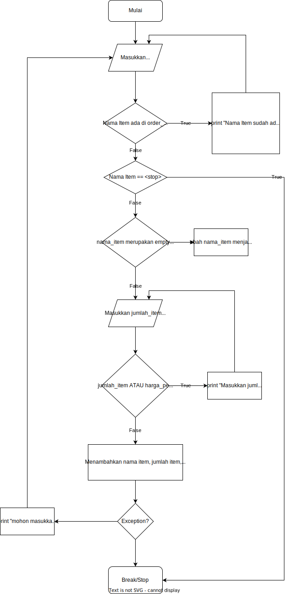
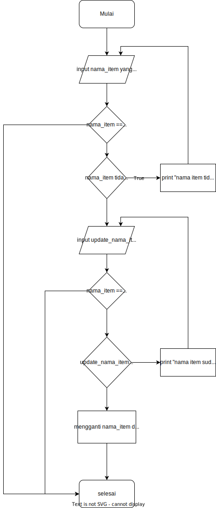
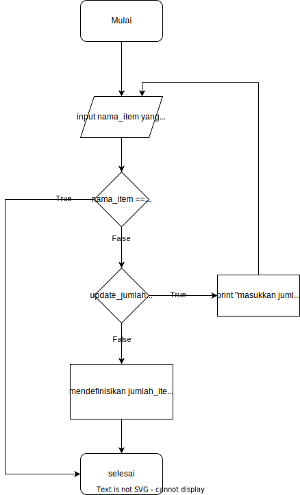
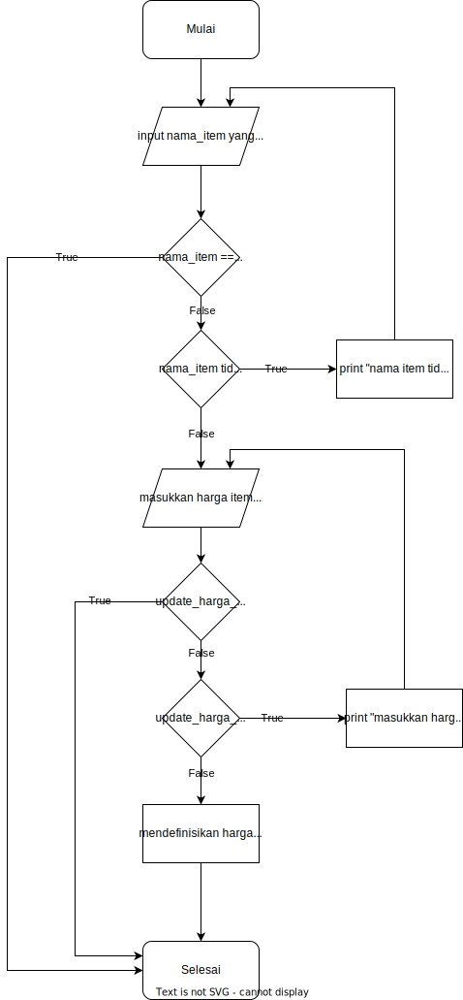
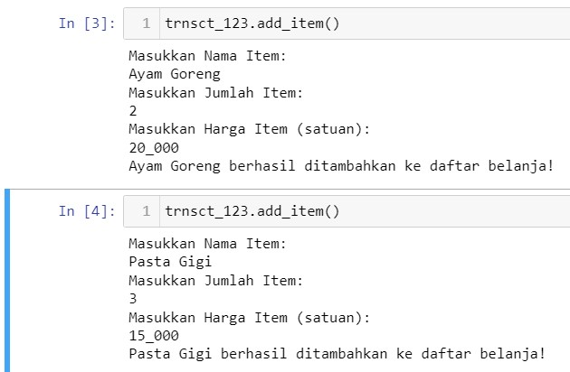
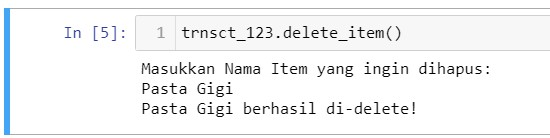
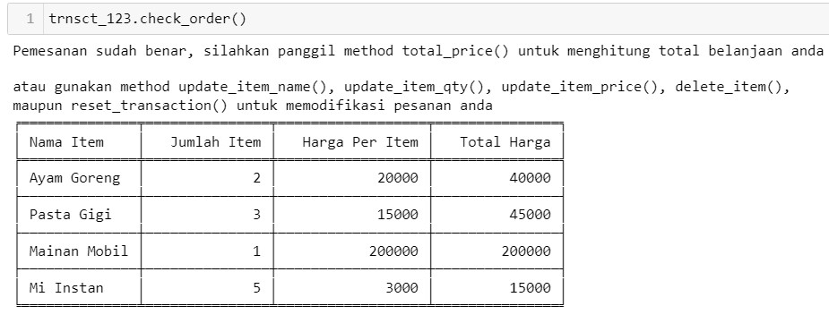
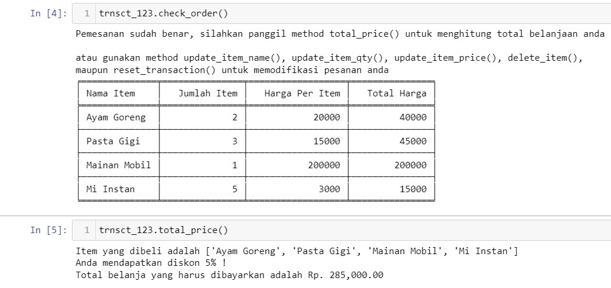

# Super Cashier

## Latar Belakang Problem

>Andi adalah seorang pemilik supermarket besar di salah satu kota di Indonesia. Andi memiliki rencana untuk melakukan perbaikan proses bisnis, yaitu Andi akan membuat sistem kasir yang selr-service di supermarket miliknya. Sehingga customer bisa langsung memasukkan item yang dibeli, jumlah item yang dibeli, dan harga item yang dibeli dan fitur yang lain.

>Sehingga customer yang tidak berada di kota tersebut bisa membeli barang dari supermarket tersebut. Setelah Andi melakukan riset, ternyata Andi memiliki masalah, yaitu Andi membutuhkan Programmer untuk membuatkan fitur-fitur agar bisa sistem kasir self-service di supermarket itu bisa berjalan dengan lancar.
___

## Requirements

* Customer dapat membuat sebuah instance id transaksi dengan memanggil class Transaction()
* Customer dapat menambahkan nama item, jumlah item dan harga per item yang dibeli sekaligus menghitung total harga item menggunakan fitur `add_item`
* Apabila terdapat kesalahan input, customer dapat mengubah nama item, jumlah item, ataupun harga per item menggunakan fitur `update_item_name`,`update_item_qty`, dan `update_item_price`
* Apabila customer ingin membatalkan pesanan, customer dapat menghapus salah satu atau keseluruhan daftar pesanan dengan fitur `delete_item` dan `reset_transaction`
* Fitur `check_order` dapat digunakan customer untuk menampilkan daftar seluruh pesanan yang telah dimasukkan
* Setelah customer sudah yakin dengan pesanannya, dapat menggunakan fitur `total_price` untuk menghitung total harga yang perlu dibayarkan dengan ketentuan diskon:
    * untuk total harga di atas Rp 200.000,- mendapat diskon 5%
    * untuk total harga di atas Rp 300.000,- mendapat diskon 8%
    * untuk total harga di atas Rp 500.000,- mendapat diskon 10%


## Alur Program
Flow Chart User Journey:


___

Flow chart untuk method `add_item`



___

Flow chart untuk method `update_item_name`



___

Flow chart untuk method `update_item_qty`



___

Flow chart untuk method `update_item_price`




## Penjelasan Code

Pada program ini terdapat beberapa fitur yang dapat dipanggil menggunakan method class

* Fitur `add_item` membutuhkan input berupa `nama_item`,`jumlah_item`, dan `harga_per_item`. Ketika memanggil method ini user akan diminta untuk memasukkan data masing-masing item, yaitu nama item, jumlah item dan harga item. Di setiap permintaan input, user dapat mengetik perintah '\<stop>' untuk menghentikan proses input. Apabila melakukan kesalahan input, seperti memasukkan empty string ("") ataupun angka nol, maka program akan mengubahnya menjadi nilai `None`. Apabila semua parameter input sudah dimasukkan, maka program akan memasukkan semua parameter input tersebut ke dalam dictionary of list bernama `order_dict` yang telah diinisialisasi di dalam class `Transaction()`. Fitur ini juga mengkalkulasikan nilai total harga masing-masing item sekaligus memasukkannya di dalam `order_dict`

**snippet code:**
```python
def add_item(self):
        while True:
            try:
                nama_item = str(input("Masukkan Nama Item:\n"))
                if nama_item in self.order_dict["Nama Item"]:
                    print("Nama Item sudah ada di dalam daftar belanja, masukkan nama item yang lain atau ketik '<stop>'\
untuk menghentikan perintah")
                    continue
                elif nama_item == "<stop>":
                    break
                else:
                    if nama_item == "" or nama_item == 0:
                        nama_item = None
                    while True:
                        try:
                            jumlah_item = int(input("Masukkan Jumlah Item:\n"))
                            if jumlah_item == "<stop>":
                                break
                            elif jumlah_item <= 0:
                                print("Masukkan jumlah item dengan benar")
                                continue
                            harga_per_item = int(input("Masukkan Harga Item (satuan):\n"))
                            if harga_per_item == "<stop>":
                                break
                            elif harga_per_item <= 0:
                                print("Masukkan harga dengan benar")
                                continue
                            else:
                                self.order_dict['Nama Item'].append(nama_item)
                                self.order_dict['Jumlah Item'].append(jumlah_item)
                                self.order_dict['Harga Per Item'].append(harga_per_item)
                                self.order_dict['Total Harga'].append(jumlah_item * harga_per_item)
                                print(f"{nama_item} berhasil ditambahkan ke daftar belanja!")
                                break
                        except:
                            self.peringatan()
                    break
            except:
                self.peringatan()

```
___
## Hasil Test Case

Untuk memulai test case, customer perlu untuk mengimport modular code `script.py` ke dalam notebook.

```python
from script.py import *
```

kemudian customer mendefinisikan instance object untuk identifikasi transaksi, sebagai contoh kita buat sebagai `trnsct_123`

```python
trnsct_123 = Transaction()
```

##### Test Case 1:
>customer menambahkan dua item baru menggunakan method `add_item`. Item yang ditambahkan adalah:
>* Nama Item: Ayam Goreng, Jumlah: 2, Harga: 20_000
>* Nama Item: Pasta Gigi, Jumlah: 3, Harga: 15_000

Untuk penyelesaian test case 1, kita dapat memanggil method `add_item()`.
Program akan menampilkan permintaan input, dan customer dapat memasukkan item belanjaan sesuai yang diinginkan.

**output**:


setelah memasukkan item belanjaan, customer dapat memeriksa daftar belanjaannya dengan memanggil method `check_order()`
.jpg)

<br>
<br>
<br>

##### Test Case 2
>Ternyata customer salah membeli salah satu item dari belanjaan yang sudah ditambahkan, maka user menggunakan method `delete_item()` untuk menghapus item. Item yang dihapuskan adalah **Pasta Gigi**.

untuk test case ke-2, customer memanggil method `delete_item()` dan memasukkan nama item yang ingin dihapus
**output:**

kemudian customer dapat memeriksa belanjaannya lagi menggunakan method `check_order()`
.jpg)
<br>
<br>
<br>

##### Test Case 3
>Ternyata setelah dipikir-pikir customer salah memasukkan item yang ingin dibelanjakan! Daripada menghapusnya satu-satu, maka Customer cukup menggunakan method `reset_transaction()` untuk menghapus semua item yang sudah ditambahkan.

kita dapat tes fitur ini dengan memasukkan beberapa data menggunakan method `add_item()` secara satu persatu data berikut:
* Nama Item: Ayam Goreng, Qty: 2, Harga: 20_000
* Nama Item: Pasta Gigi, Qty: 3, Harga: 15_000
* Nama Item: Mainan Mobil, Qty: 1, Harga: 200_000
* Nama Item: Mi Instan, Qty: 5, Harga: 3_000

kemudian kita gunakan method `check_order()` untuk menampilkan daftar belanjaan



lalu kita bisa gunakan method `reset_transaction()` untuk menghapus semua item belanjaan

**output:**
.jpg)

untuk membuktikan daftar belanjaan sudah kosong, kita dapat panggil method `check_order()` kembali

.jpg)

dengan ini, method `reset_transaction()` berfungsi!!!

<br>
<br>
<br>

##### Test Case 4
>Setelah Customer selesai berbelanja, akan menghitung total belanja yang harus dibayarkan menggunakan method `total_price()`. Sebelum mengeluarkan output total belanja akan menampilkan item-item yang dibeli.

setelah memasukkan item menggunakan method `add_item()`, customer dapat menampilkan daftar belanjaan menggunakan `check_order()` dan menampilkan harga total beserta diskon (jika ada) menggunakan method `total_price()`

**output:**


<br>

Dalam program yang saya buat, apabila customer belum melakukan `check_order()` tetapi sudah memanggil `total_price()`, maka akan me-print "Mohon gunakan method check_order() terlebih dahulu untuk memeriksa pesanan anda!". Hal ini bertujuan untuk memeriksa apakah hasil inputan sudah valid atau belum dan mencegah terjadi perhitungan harga total yang tidak valid.

**output:**
.jpg)

<br>
<br>

## Conclusion/Future Work
Telah dibuat sebuah program super cashier yang memiliki beberapa fitur seperti yang telah sesuai dengan requirement dan berdasarkan hasil test case, program yang dibuat telah berhasil berjalan dengan baik.

Pada program ini masih terdapat beberapa fitur yang dapat dikembangkan untuk kenyamanan customer, contohnya:
1. Katalog yang dapat menyandingkan antara id nama item dengan harga satuannya, sehingga customer tidak dapat memasukkan nama item selain yang ada di dalam katalog. Lebih daripada itu, customer juga tidak perlu memasukkan harga per item secara manual. 
2. Fitur yang memungkinkan untuk memasukkan item yang memiliki nama yang sama, namun harga yang berbeda
3. Fitur yang memungkinkan untuk menambahkan qty dan menghitung total harga secara otomatis jika nama item dan harga item yang dimasukkan sama dan sudah ada di dalam daftar belanja
4. Fitur yang menganggap sama (tidak mempedulikan) huruf besar/kecil pada nama item sehingga otomatis menambahkan qty dan menghitung total harga
5. FItur menambahkan item belanjaan secara bulk (langsung banyak)
